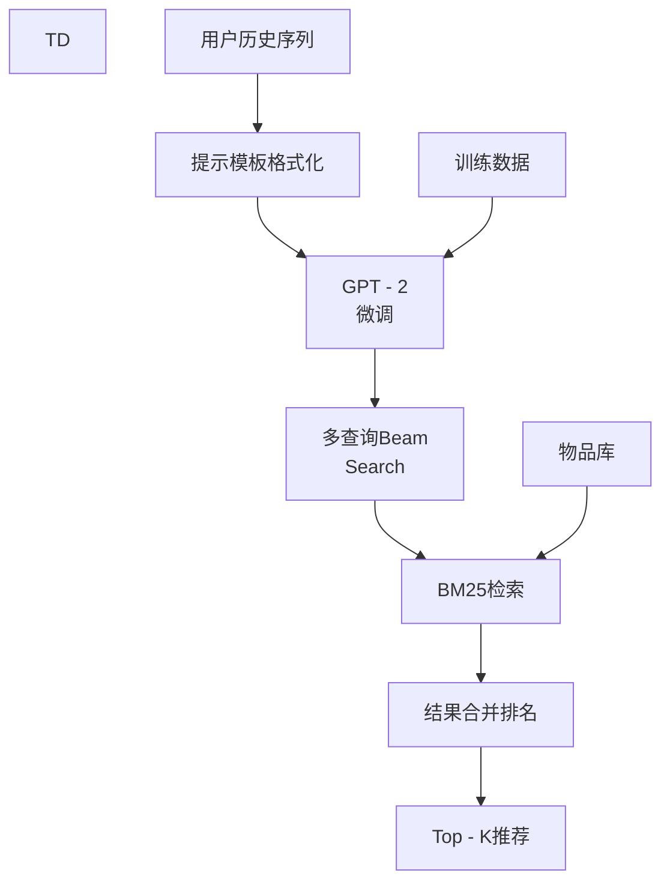

基于对GPT4Rec论文的深入分析，以下是该推荐系统的实施过程总结：

## 🎯 **总体框架概览**

GPT4Rec是一个 ** 生成式推荐框架 **，将推荐任务转化为 ** 查询生成 + 检索 ** 两个步骤，灵感来源于搜索引擎的工作原理。

```
用户历史 → 生成查询 → 搜索 → 推荐结果
```

## 📋 **实施步骤详解**

### **1. 数据预处理**
- ** 数据集 **：Amazon
Review数据（Beauty和Electronics类别）
- ** 清洗 **：移除标题缺失或过长（ > 400
字符）的物品
- ** 序列构建 **：每个用户的交互序列去重并截断为最多15项
- ** 划分 **：按用户划分训练 / 验证 / 测试集（80 % / 10 % / 10 %），采用next - item预测任务

### **2. 提示工程**
使用特定提示模板格式化输入：
```
Previously, the
customer
has
bought:
< ITEM
TITLE
1 >.< ITEM
TITLE
2 > ...
In
the
future, the
customer
wants
to
buy
```

### **3. 模型训练（两阶段）**

#### **阶段一：语言模型微调**
- ** 模型选择 **：GPT - 2（117
M参数，HuggingFace实现）
- ** 输入格式 **：用户历史前T - 1
个物品标题 + 提示
- ** 训练目标 **：生成最后一个物品标题（自回归生成）
- ** 训练配置 **：
- 优化器：Adam
with weight decay
- 学习率：0.0001
- Warm - up步骤：2000
- 训练轮数：20

#### **阶段二：搜索引擎参数优化**
- ** 搜索算法 **：BM25
- ** 参数调优 **：网格搜索
- `k1 ∈ {0, 3}
`（控制词频饱和度）
- `b ∈ (0, 1)
`（控制文档长度归一化）
- ** 优化目标 **：检索准确率（Recall @ K）

### **4. 多查询生成（核心技术）**
- ** 策略 **：Beam
Search生成多个查询
- ** 动机 **：捕获用户多维度、多粒度兴趣
- ** 实现 **：
- 给定beam
size
`m`
- 基于生成分数
`S(W ^ it, q)`
选择top - m查询
- 长度逐步扩展，保持多样性
- ** 优势 **：提高推荐多样性和覆盖率

### **5. 检索与排名策略**
- ** 检索 **：每个查询用BM25检索相关物品
- ** 排名合并 **：
1.
从生成分数最高的查询取top - K / m个物品
2.
依次从其他查询按分数取非重复物品
3.
直到凑齐K个推荐
- ** 平衡 **：相关性与多样性

### **6. 评估指标**
- ** 主指标 **：Recall @ K（是否包含目标物品）
- ** 多样性 **：Diversity @ K（基于Jaccard相似度）
- ** 覆盖率 **：Coverage @ K（覆盖用户历史类别 / 品牌比例）

## ⚙️ **关键技术要点**

### **核心创新**
1. ** 生成式方法 **：将推荐视为序列生成问题
2. ** 语言空间学习 **：用户和物品都在语义空间表示
3. ** 多查询生成 **：Beam
Search产生多样化兴趣表示
4. ** 解耦架构 **：语言模型和搜索引擎独立优化

### **实践优势**
- ** 可解释性 **：生成的查询直接解释用户兴趣
- ** 冷启动友好 **：可通过查询检索新物品
- ** 灵活性 **：可替换底层模型（LLM / 搜索引擎）
- ** 语义利用 **：充分利用物品标题的语义信息

## 🔄 **实施流程总结**



## 📊 **性能关键发现**

1. ** 最佳配置 **：生成K个查询，每个查询检索1个物品（K = K）
2. ** 性能提升 **：
- Beauty数据集：Recall @ 40
提升75
.7 %
- Electronics数据集：Recall @ 40
提升22
.2 %
3. ** 多样性提升 **：多查询显著提高Diversity @ K和Coverage @ K

## 🛠️ **代码实现要点**

```python


# 伪代码结构
class GPT4Rec:
    def __init__(self):
        self.lm = GPT2()  # 语言模型
        self.se = BM25()  # 搜索引擎

    def train(self, user_sequences):
        # 阶段1：微调语言模型
        self.lm.finetune(sequences)

        # 阶段2：优化搜索参数
        self.se.grid_search(queries, items)

    def recommend(self, user_history, k=10):
        # 生成多个查询
        queries = self.lm.beam_search(user_history)

        # 检索物品
        candidates = []
        for query in queries:
            items = self.se.search(query, top_n=k // len(queries))
            candidates.extend(items)

        # 去重和排名
        return self.rank_and_deduplicate(candidates, k)


```

## 💡 **扩展思考**

1. ** 模型升级 **：可替换GPT - 2
为更新的LLM（GPT - 3 / 4、Llama等）
2. ** 检索优化 **：BM25可升级为神经网络检索器（如DPR）
3. ** 工业部署 **：需考虑实时性、索引效率、模型更新机制

这个框架的创新在于将 ** 生成式语言建模 ** 与 ** 信息检索 ** 巧妙结合，为推荐系统提供了新的视角和强大的可解释性。